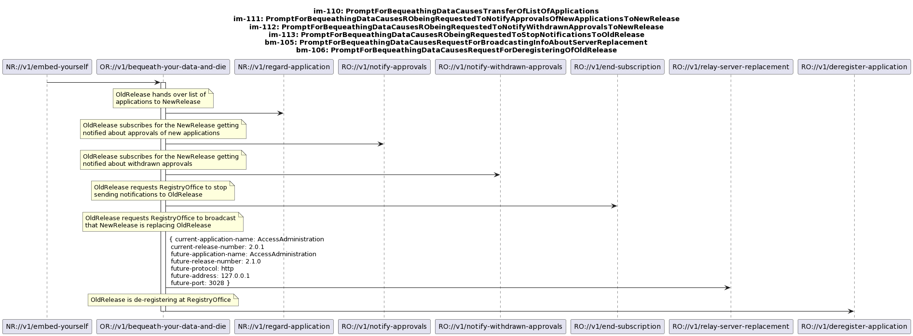
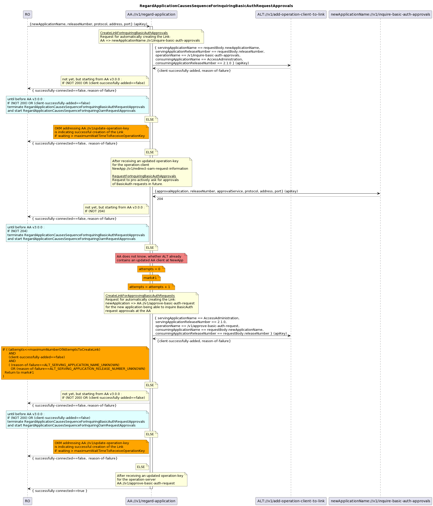
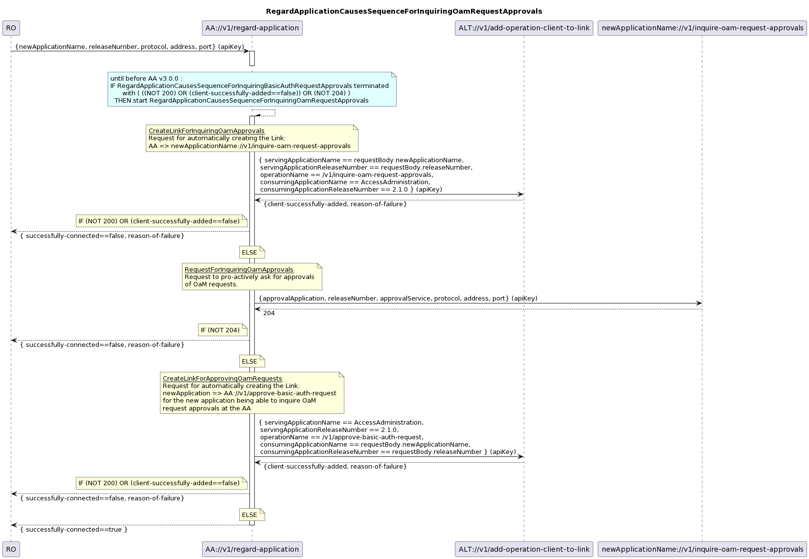
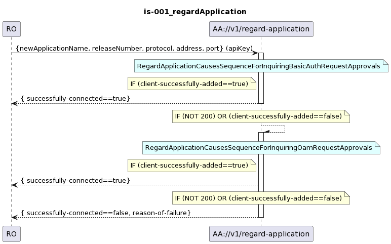
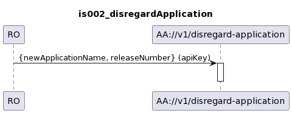
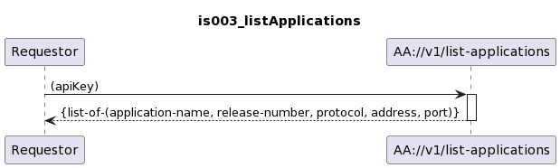
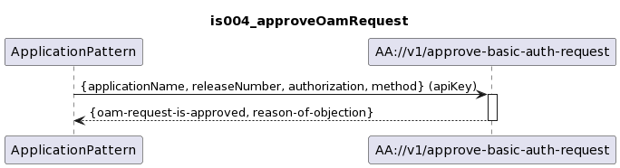
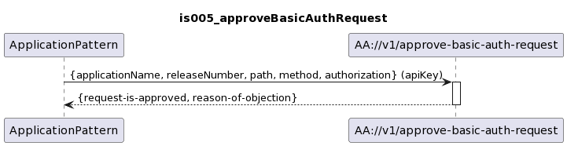

# AccessAdministration Diagrams
## Forwardings
.  
.  
  
.  
.  
  
.  
.  
  
.  
.  
  
.  
.  
## Service View
.  
.  
  
.  
.  
  
.  
.  
  
.  
.  
  
.  
.  
  
.  
.  
  
.  
.  
  
.  
.  
  
.  
.  
  
.  
.  